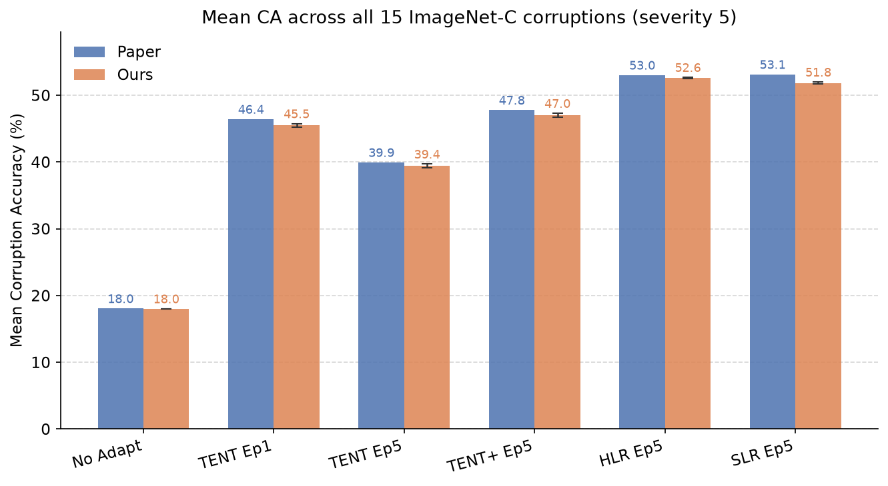
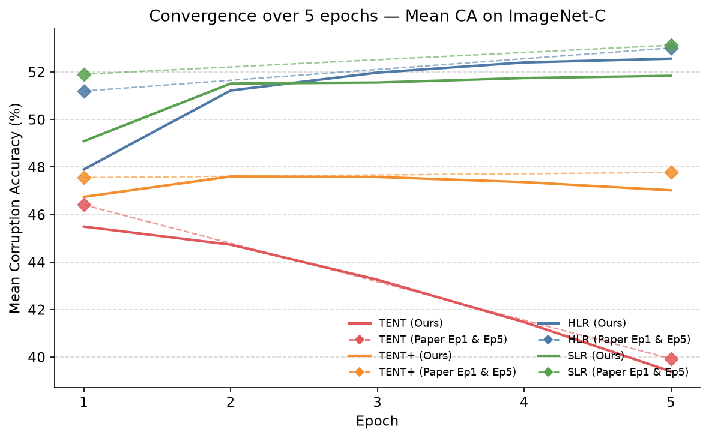

# Reproducing Mummadi et al. 2021: Test-Time Adaptation On ImageNet-C

## Introduction

Neural networks are remarkably good at what they were trained to do and remarkably brittle the moment conditions change. A model trained on clean ImageNet photographs can lose the vast majority of its accuracy when those same images are blurred, noised, fogged, etc. This is not a niche failure. It is a fundamental property of how these models work, and it surfaces constantly in real world deployment.
The root cause is distribution shift: the statistical gap between the data a model was trained on and the data it actually encounters. During training, a model learns to exploit patterns specific to its training distribution. When the test distribution differs learned patterns no longer map cleanly to correct predictions, and performance collapses, even in ways that are perceptually minor to a human, like a jpeg compression or a thin layer of simulated snow. 

The most obvious solution to distribution shift is to account for it during training: include corrupted examples in the data mix. These approaches do help, but they require anticipating the shift in advance. In practice, the space of possible real world corruptions is too wide to cover comprehensively.

Domain adaptation is similar. It requires source data and target domain data to periodically update the model weights so that the model can adapt to changes in the target distribution. During periodic training, the model learns feature representations that are useful for the task while minimizing domain specific information, allowing knowledge learned from the source domain to transfer more effectively to the target domain. However, access to the original source data is not always possible, as it may be proprietary, restricted for privacy reasons, or too large to store alongside a deployed model. In such cases, alternative approaches are needed to adapt the model without retaining the original training data.

Fine-tuning on target data is also ruled out as it requires labels, which by definition are not available at test time when you are classifying new, unseen examples.
This is the gap that test time adaptation is designed to fill. The setting is deliberately minimal, where only pretrained model, unlabeled data from the shifted target distribution is provided without labels, source data, changing how the model was originally trained (except batch norm).

Mummadi et al. propose a fully test-time adaptation method that improves the robustness of pretrained image classifiers under distribution shifts without requiring source domain data or target labels. Their approach addresses known limitations of entropy minimization, such as premature convergence and instability, by introducing a non-saturating surrogate loss and a diversity regularizer that prevents the model from collapsing to trivial predictions. Additionally, they prepend a learnable input transformation module that adapts corrupted inputs before they are processed by the classifier, enabling the model to better handle distribution shifts. This work is particularly worth reproducing because it offers a practical and data efficient solution for adapting deployed models in scenarios where access to the original training data is unavailable, while reporting significant improvements on challenging benchmarks such as ImageNet-C.

## Methods

### What gets adapted?

The main assumed constraint is that we have no access to uncorrupted training data. This is realistic in the sense that, if you are trying to do an image classification task on a low-quality dataset (e.g. a degraded CCTV footage), it is unlikely that you will obtain a set of clean, uncorrupted training samples later on. Hence, TTA is not a design choice in many contexts, but essentially an requirement.

TTA takes a pretrained model $f_\theta$ (we only use a ResNet50 from `torchvision`) and, at test time,   defines either a subset of parameters $\varphi \subseteq \theta$ or the entire parameter space $\theta$ to adapt. Both Wang et al., and Mummadi et al. adapt only a subset $\varphi$ for a multitude of reasons:
* $\theta$ encodes all source knowledge; updating it unsupervised on a few corrupted batches risks overwriting learned representations with noisy, unguided gradient updates, 
* High dimensional (e.g. ResNet50, ~25m parameters), unstable optimization with no supervision signal,
* Too slow for test-time usage; full backprop through the whole model is too expensive.

Once one has defined a subset $\varphi$ to adapt, the next design decision is to determine how these parameters will be optimized:
* Self-supervised approaches construct proxy tasks from the data itself—such as rotation prediction, context prediction, or cross-channel auto-encoding (Gidaris et al., 2018; Doersch et al., 2015; Zhang et al., 2017)—and TTT (Sun et al., 2019) applies this at test time; 
* Unsupervised approaches does not utilize constructed tasks as they optimize directly on the structure of the model's own predictions. 

In our case, the problem with self-supervised for TTA is the need to design a proxy task that is compatible with both the domain (corrupted images) and the model architecture. Moreover, it is not also guaranteed that the proxy task will help as it might just conflict with the original classification objective. For instance, optimizing for rotation prediction doesn't directly help image classification, and can even hurt it. Wang et al. explicitly show that TENT (unsupervised) outperforms TTT (self supervised rotation prediction; Sun et al., 2019) despite TTT being more complex. 

We can then formally define our unsupervised loss $L$, computed solely on the incoming target batches (no labels, corrupted). The loss performs gradient updates on $\varphi$, which are the BN affine parameters ($\gamma,\beta$) of the BatchNorm layers in the pretrained ResNet50 model. These parameters are chosen for three reasons: 
* they are channel-wise scale and shift operations that directly control feature expression, 
* constitute less than 1% of the total model parameters making optimization stable (Wang et al., 2021),
* and BN statistics ($\mu, \sigma$) can be simultaneously be re-estimated from the target batch, which corrects the normalization mismatch introduced by distribution shift.

Consequently, all convolutional weights and the classification head remain frozen throughout adaptation as the learned representations are assumed to still be useful. The corruptions cause distribution shift, hence only the normalization and expression of the features needs to be corrected.

### Adaptation Objective

Table 1 features a number of distinct approaches, namely 'No Adaptation', 'Pseudo Labels', TENT, TENT+, HLR and SLR. We will be introducing each in order, and expound upon their individual implementations. 

For 'No Adaptation', we have our pretrained ResNet50 applied directly to corrupted images, zero parameter updates. This is essentially the lower bound of performance, representing how badly a model trained on clean data fails under distribution shift. Furthermore, it will also signal whether any of the changes degrade the model so significantly that it is essentially worse than a non-adapted model.

Mummadi et al. actively build upon Wang et al.'s TENT, making it the natural baseline for Table 1 (our reproduction objective). The working principle is that: at each test batch, TENT computes the Shannon entropy $\mathcal{H}(s) = -\sum{p(x)}\log{p(x)}$ of the model's softmax predictions and minimizes it via backpropagation through the BN affine parameters. Entropy is a measure of uncertainty in a set of possible outcomes, and in this context, the intuition of applying it is that a well-adapted model should be confident about its predictions on the target distribution. In other words, minimizing entropy pushes the model toward more decisive class predictions on the corrupted target data. 

**Definition**: $L_{ent}$
$$ L_{ent}(\hat{y}) = -\sum_{c}{\hat{y}_c\log{\hat{y}_c}}$$
where $\hat{y}= \text{softmax(logits)}$ and the sum is over all classes $c$. Note that minimizing entropy on individual predictions has a trivial solution: assign all probability to a single class, yielding zero entropy regardless of inputs—not exactly a very promising method. TENT circumvents this by optimizing over batched predictions through the shared BN affine parameters. Since $\gamma$ and $\beta$ are shared across all samples in a batch, the model cannot collapse on a per-sample basis and must instead find parameters that reduce uncertainty across the batch, not specific to a singular sample.

However, entropy minimization by itself has its own limitations. This inherent limitation is what motivates Mummadi et al.'s core claim: "pure entropy minimization results in vanishing gradients for high confidence predictions, thus inhibiting learning." Furthermore, the problem is that the gradiennt magnitude $\partial L_{ent}/\partial o \rightarrow 0$ as $\hat{y} \rightarrow 1$. For a binary classification task, the maximum logits' gradient amplitude is at $\hat{y} \approx (0.82, 0.18)$ (Mummadi et al., 2021; Section 3.2.2). In later stages of TTA when most predictions are already above 0.82 confidence, gradients are dominated by the low-confidence samples. 

In virtue of this, Mummadi et al. asks: "How can we stop the model from becoming overconfident on the wrong classes after awhile?" To address this, the paper's first incremental suggestion is to replace entropy with losses based on the negative log likelihood ratio, which provide non-vanishing radients even for high-confidence predictions.

**Definition:** $R(\hat{y}, y^r)$
$$R(\hat{y}, y^r) = -\sum_c y^r_c \log \frac{\hat{y}_c}{\sum_{i \neq c} \hat{y}_i}$$
Unlike entropy, $R$ is unbounded below: as confidence $\hat{y}_c^{*} \rightarrow 1$, the sum $\sum_{i \neq c^*}\hat{y}_i \rightarrow 0$ and thus $\log{\sum_{i \neq c^*}\hat{y}_i} \rightarrow - \infty$. This property guarantees non-vanishing gradients for high-confidence predictions, which means that the model will keep receiving a meaningful update signal even when it is already confident. 

The first loss considered by the researchers is the *hard likelihood ratio* (HLR) loss:

**Definition**: $L_{hlr}(\hat{y})$
Uses a one-hot reference on the argmax class $c^* = \arg \max{\hat{y}}$:
$$ L_{hlr}(\hat{y}) = -o_c^{*} + \log{\sum_{i \neq c^{*}}e^{o_i}}$$
The gradient $\partial L_{hlr}/\partial o_{c^*} = -1$ is constant regardless of confidence; high and low confidence contribute equally to the gradient update. 

Their second proposed loss is the *soft likelihood ratio* (SLR):

**Definition**: $L_{slr}(\hat{y})$
Uses the softmax probabilities themselves as weights, accounting for prediction uncertainty:
$$L_{slr}(\hat{y}) = \sum_c \hat{y}_c \left(-o_c + \log \sum_{i \neq c} e^{o_i}\right)$$
As $\hat{y}_c^{*} \rightarrow 1$, $L_{slr} \rightarrow L_{hlr}$, which implies that two losses converge for high-confidence predictions. For low-confidence predictions, SLR produces smaller gradient amplitudes than HLR, making it a middle ground between HLR and entropy. 

While HLR and SLR addresses the vanishing gradient problem,  confidence maximization nevertheless still fails to address another issue: the model can satisfy either loss trivially by collapsing to predict a single class for every input. To prevent this from happening, Mummadi et al. introduce a diversity regularizer $L_{div}$ that penalizes the model if its prediction distribution deviates from uniform (i.e. predictions must be uniformly spread across classes).

$L_{div}$ is defined as the KL divergence from the running average prediction distribution $p_t$ to the target distribution $p_{D'}$ (assumed uniform over classes):

$$L_{div} = D_{KL}(p_t || p_{D'})$$

The running average $p_t$ is updated as:
$$ p_t = \kappa \cdot p_{t-1} + (1-\kappa) \cdot p_t^{emp}$$
where $p_t^{emp} = \frac{1}{n}\sum^{n}_{k=1}{\hat{y}^{(k)}}$ is the mean prediction over the current batch. Both papers use a running average rather than a batch-wise estimate because ImageNet has 1000 classes with a batch size of 64, meaning that a single batch cannot cover the full class distribution reliably. 

The final loss combines both terms:
$$ L = L_{div} + \delta \cdot L_{conf}$$
where $L_{conf}$ is either $L_{hlr}$ or $L_{slr}$. However, as a straight-forward augmentation to TENT, Mummadi et al. introduces TENT+ which is essentially TENT with $L_{div}$ added (i.e. $L = L_{div} + \delta \cdot L_{enf}$).

Finally, the last shortcoming addressed by Mummadi et al. is the logit explosion problem caused by the likelihood ratio losses being unbounded below which leads to loss being reduced even if the relative class probabilities remain unchanged. To prevent this, the affine parameters of the top layer (layer4 in ResNet50) are frozen for all HLR and SLR runs. BN statistics in layer4 still update, but the affine parameters do not. With layer4 frozen, batch normalization in the remaining layers prevents logits from growing unbounded. For consistency, same is applied to TENT+. 

### Reproduction Framework
Upon interpreting the paper, the distinct areas of contribution is apparent:
* the loss functions,
* the input transform neural network.

Matter of fact, to reproduce Table 1, the only requirements for successful reproduction are the one-to-one tranining environment replication and correct implementation of all loss functions. However, the paper does not sufficiently clarify whether the input transform neural network was used to generate some of the Table 1 values. Due to this, we unnecessarily implemented the input transform feature, and only realized that we didn't have to later on in the reproduction project. In regards to this, when introducing incremental architectural improvements such as in this paper, make which result belongs to which architectural configuration. 

Moving onto how 

## Experimental Setup
*(Arda - Task #3)*

We evaluate all methods on ImageNet-C (Hendrycks & Dietterich, 2019; [link to dataset](https://zenodo.org/records/2235448)), a benchmark of 15 synthetic corruptions applied to the ImageNet validation set at severity level 5. The corruptions span four categories: noise (Gaussian, shot, impulse), blue (defocus, glass, motion, zoom), weather (snow, frost, fog, brightness), and digital (contrast, elastic transform, pixalte, JPEG compression). We report top-1 accuracy averaged over 3 random seeds (2020, 2021, 2022) following Mummadi et al. 

We use a ResNet50 pretrained on clean ImageNet (torchvision `IMAGENET1K_V1` weights) as the base model for all methods. This detail was not mentioned in the original paper, so we had to test both `IMAGENET1K_V1` and `IMAGENET1K_V2` to discern which one they originally used in their experiment. Only the BN affine parameters are optimized; BN statistics are re-estimated rom each traget batch by running statistics (`track_running_stats=False`). 

For No Adaptation, the pretrained model is evaluated directly with no parameter updates, so no optimizer, learning rate, or adaptation hyperparameters apply. For TENT, we follow Wang et al. (code available [here](https://github.com/DequanWang/TENT)) and use SGD with momentum 0.9 and a constant learning rate of 0.00025. For TENT+, HLR, and SLR we use Adam with cosine decay and learning rate 0.0006. All methods use batch size 64 and are run for 5 epochs on the entire dataset (50,000 images per corruption). For HLR, SLR and TENT+, layer4 affine parameters are additionally frozen. We set $\delta=0.025$ and $\kappa=0.9$ for all runs involving $L_{div}$.

To ensure fair comparison, all methods share the same DataLoader for a given (corruption, seed) pair, and data ordering is identical across methods within each run.

| Hyperparameter | TENT | TENT+ | HLR | SLR | No Adaptation |
|---|---|---|---|---|---|
| Optimizer | SGD | Adam | Adam | Adam | — |
| Learning rate | 0.00025 | 0.0006 | 0.0006 | 0.0006 | — |
| LR schedule | constant | cosine decay | cosine decay | cosine decay | — |
| Momentum | 0.9 | — | — | — | — |
| Batch size | 64 | 64 | 64 | 64 | 64 |
| Epochs | 5 | 5 | 5 | 5 | 1 (no update) |
| δ | — | 0.025 | 0.025 | 0.025 | — |
| κ | — | 0.9 | 0.9 | 0.9 | — |
| layer4 frozen | ✗ | ✓ | ✓ | ✓ | — |
| Seeds | 2020, 2021, 2022 | 2020, 2021, 2022 | 2020, 2021, 2022 | 2020, 2021, 2022 | 2020, 2021, 2022 |

For full code implementation, you can visit our repo [here](https://github.com/westend11/dsait4205-reproduction-g8).

## Results

We compare our reproduced results against those reported by the paper across all five methods on ImageNet-C at severity 5. Top-1 accuracy is averaged over three random seeds (2020, 2021, 2022); standard deviation σ is computed across seeds. Figure 1 gives an overview of mean Corruption Accuracy (Mean CA) per method, and Table 1 breaks this down per corruption at the final epoch (Ep5). The convergence plot (Figure 2) shows how mean CA evolves over all 5 epochs, a perspective the final-epoch table alone cannot convey.

*Figure 1: Mean CA across all 15 ImageNet-C corruptions at severity 5. Paper values in blue, ours in orange. Error bars on our results show σ across seeds. TENT is shown at both Ep1 (before degradation) and Ep5 (after degradation) to make the collapse visible.*

**Table 1** — Top-1 accuracy (%) per corruption and method. Each cell shows: Paper / **Ours** ±σ. All adaptive methods show Ep5 results; σ is the standard deviation across three seeds.

| Corruption | No Adapt (P / O) | TENT Ep5 (P / O) | TENT+ Ep5 (P / O) | HLR Ep5 (P / O) | SLR Ep5 (P / O) |
|:--|--:|--:|--:|--:|--:|
| Gaussian Noise | 2.44 / **2.21** | 16.04 / **16.31** ±0.04 | 33.97 / **35.19** ±0.12 | 41.37 / **42.44** ±0.06 | 41.52 / **42.21** ±0.13 |
| Shot Noise | 2.99 / **2.93** | 23.22 / **27.17** ±0.71 | 37.95 / **38.21** ±0.02 | 44.04 / **44.69** ±0.02 | 42.90 / **44.46** ±0.12 |
| Impulse Noise | 1.96 / **1.85** | 25.85 / **27.49** ±0.18 | 36.93 / **37.57** ±0.35 | 43.68 / **44.08** ±0.14 | 44.07 / **44.09** ±0.04 |
| Defocus Blur | 17.92 / **17.92** | 19.05 / **17.66** ±0.66 | 32.69 / **31.66** ±0.25 | 41.74 / **40.78** ±0.20 | 41.69 / **40.80** ±0.10 |
| Glass Blur | 9.82 / **9.82** | 17.40 / **15.62** ±1.31 | 33.36 / **32.10** ±0.25 | 41.09 / **40.23** ±0.21 | 40.78 / **39.94** ±0.12 |
| Motion Blur | 14.78 / **14.78** | 49.02 / **47.66** ±0.10 | 51.42 / **50.30** ±0.13 | 54.26 / **53.34** ±0.17 | 54.76 / **53.95** ±0.02 |
| Zoom Blur | 22.50 / **22.50** | 52.78 / **51.43** ±0.21 | 54.33 / **53.14** ±0.07 | 56.43 / **55.44** ±0.16 | 56.59 / **55.72** ±0.11 |
| Snow | 16.89 / **16.89** | 52.72 / **51.62** ±0.11 | 54.55 / **53.56** ±0.03 | 57.03 / **56.14** ±0.21 | 57.35 / **56.54** ±0.06 |
| Frost | 23.31 / **23.31** | 34.31 / **33.27** ±0.37 | 45.80 / **44.85** ±0.14 | 50.81 / **49.81** ±0.08 | 51.01 / **50.05** ±0.09 |
| Fog | 24.43 / **24.43** | 61.19 / **59.96** ±0.08 | 62.09 / **61.04** ±0.06 | 63.05 / **62.21** ±0.08 | 63.53 / **62.71** ±0.03 |
| Brightness | 58.93 / **58.93** | 68.54 / **67.80** ±0.14 | 68.72 / **68.35** ±0.10 | 68.29 / **67.54** ±0.07 | 68.72 / **67.93** ±0.04 |
| Contrast | 5.43 / **5.43** | 1.26 / **0.77** ±0.20 | 24.08 / **21.70** ±2.29 | 50.98 / **51.97** ±0.11 | 50.65 / **38.54** ±1.07 |
| Elastic Transform | 16.95 / **16.95** | 59.26 / **58.05** ±0.14 | 60.36 / **59.21** ±0.11 | 61.15 / **60.30** ±0.08 | 61.49 / **60.55** ±0.04 |
| Pixelate | 20.61 / **20.61** | 62.15 / **61.02** ±0.12 | 63.10 / **62.11** ±0.11 | 63.08 / **62.19** ±0.07 | 63.46 / **62.62** ±0.05 |
| JPEG Compression | 31.65 / **31.65** | 56.17 / **55.08** ±0.04 | 57.21 / **56.24** ±0.02 | 58.13 / **57.22** ±0.07 | 58.32 / **57.44** ±0.03 |
| **Mean CA** | **18.04** / **18.01** | **39.93** / **39.39** ±0.29 | **47.77** / **47.02** ±0.27 | **53.01** / **52.56** ±0.11 | **53.12** / **51.84** ±0.14 |

*Figure 2: Mean CA over 5 adaptation epochs for each method. Solid lines -> our reproduced results across all 5 epochs. Dashed lines with diamond markers -> paper-reported values at Ep1 and Ep5 (intermediate epochs were not reported in the paper). The steady decline of TENT and the steady rise of HLR and SLR are the key qualitative signatures to verify.*

Seed variance is low for all methods at convergence: σ averaged across all 15 corruptions is 0.11pp for HLR and 0.14pp for SLR at Ep5. TENT shows higher average variance (0.29pp), driven by corruptions where the method either collapses fully or stabilizes erratically depending on initialization order.

## Discussion

### Do our results match the paper's conclusions?

Broadly, yes. The central ranking reported by the paper holds: SLR and HLR substantially outperform TENT+, which in turn substantially outperforms the entropy-minimization baseline TENT, which itself far exceeds No Adaptation. At Ep5, our mean CA across all 15 corruptions is 52.6% for HLR and 51.8% for SLR, against the paper's 53.0% and 53.1%, gaps of 0.45pp and 1.29pp respectively. The No Adaptation baseline matches nearly exactly (18.0% vs 18.0%), confirming that our evaluation pipeline and pretrained weights are correctly configured.

### TENT instability confirmed

TENT starts competitive (45.5% mean CA at Ep1 versus the paper's 46.4%), but degrades monotonically to 39.4% by Ep5 (paper: 39.9%). This trajectory is clearly visible in Figure 2 and is the most cleanly reproduced qualitative result in the paper. It validates the core motivation of Mummadi et al.: entropy minimization continues pushing predictions toward degenerate solutions once most samples are already high-confidence, because the gradient magnitude vanishes for confident predictions. Adding $L_{div}$ alone (TENT+) is sufficient to halt the collapse: our TENT+ rises from 46.7% at Ep1 to a peak around 47.6% at Ep2 before settling at 47.0% at Ep5, confirming that the diversity regularizer is the critical stabilizing component.

### Where gaps exist

For 13 of the 15 corruptions, our Ep5 numbers fall within 1–2pp of the paper's values across all methods. The direction of the gap is consistent: our values are slightly below the paper's, by an average of 0.76pp for TENT+, 0.45pp for HLR, and 1.29pp for SLR. Likely contributors include minor implementation differences (the exact ResNet50 checkpoint variant, learning rate schedule granularity, and cold-start initialization of the running average $p_t$), rather than any fundamental divergence in algorithm.

The **Contrast** corruption is a striking outlier for SLR. Our reproduction achieves 38.5% at Ep5 versus the paper's 50.65%, a 12.1pp gap. Looking at the per-epoch trajectory, our SLR initially improves to 47.8% by Ep2, then collapses to 38.5% by Ep5. This instability is consistent across all three seeds (σ = 1.07pp at Ep5), ruling out randomness as the cause. Notably, HLR handles Contrast correctly, even slightly exceeding the paper (51.97% ours vs 50.98% paper), so the failure is specific to SLR's soft-weighting scheme on this corruption type. A plausible mechanism: under extreme contrast degradation, a small set of wrong but high-confidence predictions receives large gradient weight from SLR's softmax-weighted pseudo-labels. HLR, by using a hard argmax, is immune to this amplification. This finding does not materially affect the Mean CA comparison given that Contrast is one of fifteen corruptions, but it is worth noting as a potential fragility.

A second, more subtle gap appears at Ep1: our HLR and SLR start 3.3pp and 2.8pp below the paper's Ep1 values respectively, even though by Ep5 the gap closes to 0.45pp and 1.29pp. This points to a slower initial convergence rate in our implementation rather than a lower accuracy ceiling. Figure 2 makes this visible: our solid curves start below the paper's Ep1 markers (diamonds) but converge toward them by Ep5.

### What the reproduction confirms vs cannot confirm

The reproduction confirms the following claims from the paper:

- **Gradient vanishing causes catastrophic forgetting in TENT**: reproduced quantitatively, with identical qualitative trajectory across all 15 corruptions.
- **$L_{div}$ prevents collapse**: adding the diversity regularizer to entropy minimization (TENT+) is sufficient to stabilize adaptation across all corruptions.
- **Non-saturating losses improve convergence**: HLR and SLR both converge to substantially higher accuracy than TENT+ across all noise, blur, weather, and digital corruption categories, consistent with the theoretical argument for non-vanishing gradients.
- **Reproducibility with public tools**: all results were obtained using the torchvision `IMAGENET1K_V1` pretrained ResNet50, standard PyTorch, and the public ImageNet-C dataset — no private infrastructure or custom training was required.

What it cannot confirm:

- **The input transformation module (IT)**: the paper reports further accuracy gains from prepending a learnable network that partially undoes the corruption before it reaches the classifier. We did not evaluate this component. The IT module adds trainable parameters and requires additional adaptation compute, and its evaluation was outside the scope of our reproduction.

### Value of the reproduction

Two things emerge beyond a simple numerical comparison. First, the core algorithmic contributions of Mummadi et al. are robust and reproducible: the non-saturating loss and diversity regularizer produce the claimed improvements with standard, publicly available tools, which matters for practitioners who want to build on this work without access to the original codebase. Second, the Contrast instability under SLR is a new observation that is not visible in the paper's aggregate numbers. Whether this reflects a genuine fragility of the SLR objective under extreme photometric shifts, a sensitivity to specific hyperparameters such as the learning rate or δ, or a gap between our cold-start of $p_t$ and the original implementation, is an open question that future work on TTA robustness could investigate.

## References

* Mummadi, C.K., Hutmacher, R., Rambach, K., Levinkov, E., Brox, T., & Metzen, J.H. (2021). Test-time adaptation to distribution shift by confidence maximization and input transformation. arXiv:2106.14999. https://arxiv.org/abs/2106.14999
* Wang, D., Shelhamer, E., Liu, S., Olshausen, B., & Darrell, T. (2021). Tent: Fully test-time adaptation by entropy minimization. arXiv:2006.10726. https://arxiv.org/abs/2006.10726
* Gidaris, S., Singh, P., & Komodakis, N. (2018). Unsupervised representation learning by predicting image rotations. ICLR 2018. https://arxiv.org/abs/1803.07728
* Doersch, C., Gupta, A., & Efros, A.A. (2015). Unsupervised visual representation learning by context prediction. ICCV 2015. https://arxiv.org/abs/1505.05192
* Zhang, R., Isola, P., & Efros, A.A. (2017). Split-brain autoencoders: Unsupervised learning by cross-channel prediction. CVPR 2017. https://arxiv.org/abs/1611.09842
* Sun, Y., Wang, X., Liu, Z., Miller, J., Efros, A., & Hardt, M. (2020). Test-time training with self-supervision for generalization under distribution shifts. ICML 2020. https://arxiv.org/abs/1909.13231

## Individual Contributions

Arda 
* Implemented `run_tent.py`, `losses.py`, `model_utils.py`, `datasets.py`, `utils.py`, and completed functionality of other files in `experiments/`
* Wrote the methodology and experimental setup parts
* Ran TENT, TENT+, HLR, No Adaptatation (100h+ of training)
* Revised the poster made by Emils

Emils
* Implemented `run_input_transform`', `input_transform`, directml usability for amd gpus
* Wrote introduction
* Ran half of the SLR (10-15h)
* Initial half of the poster, later revised

Radu
* Implemented `run_eval.py`, `metrics.py`, `default.yaml` (config), all logging systems.
* Wrote results (+generated and refined figures), discussion
* Ran other half of the SLR (10-15h)